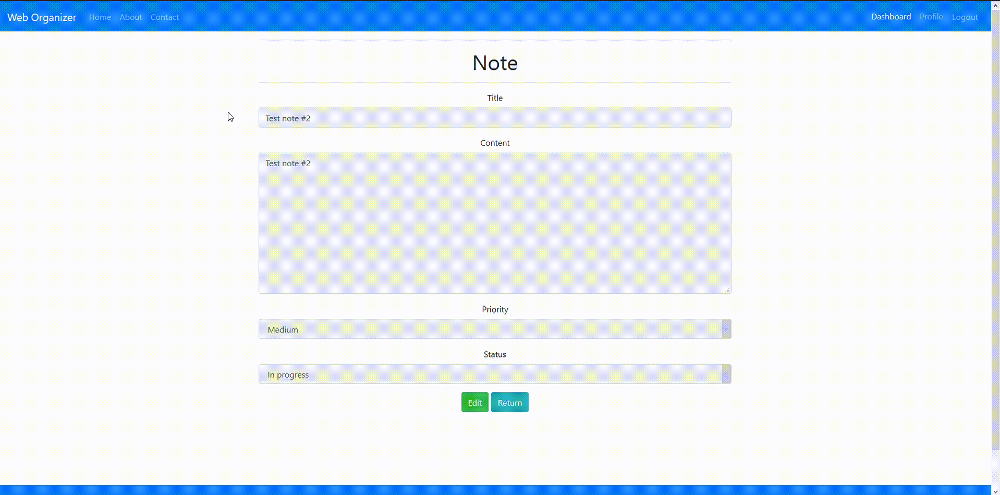

# Web Organizer
MEN stack web application designed to help you organize your day-to-day routine. Create your own notes, set their priority and control them via status property.<br />

## Table of contents
[Description](#description)<br />
[Technologies](#technologies)<br />
[Public tests environment](#public-tests-environment)<br />
[File structure](#file-structure)<br />
[Current features](#current-features)<br />
[Installation](#installation)<br />
[TODO](#todo)<br />
[Licence](#licence)<br /><br />

## Description
Web Organizer allows you to add and modify notes with a simple title-body structure. You can use HTML tags directly in your note's body in order to better organize their structure and display.<br />

## Technologies
* NodeJS<br />
* ExpressJS<br />
* Bootstrap
* Embedded JavaScript templating<br />
* Mongoose<br />
* Nodemailer<br /><br />

## Public tests environment
You can check out the application under following links:<br /><br />
http://78.46.150.191:3300 or http://jsarnowski.pl/weborganizer<br /><br />

## File structure
- `/`: root directory containing server/app configuration files and environmental variables<br />
- `/src`: root directory for views, partials, routes, etc.<br />
- `/src/locales`: JSON language packs (WIP)<br />
- `/src/config`: sets of rules used by the authentication module<br />
- `/src/routes`: contains all of the backend routing within the app, including user request handlers<br />
- `/src/models`: contains basic DB schemas used by the application<br />
- `/src/views`: stores all `.ejs` view files and templates served as a frontend<br />
- `/src/views/partials`: stores `.ejs` 'sub-views', loaded either in `layout.ejs` or appropriate view file in `/src/views`<br /><br />

## Current features
- Perform basic CRUD operations within your dashboard<br />
- Supports HTML tags embedded directly in note's body. Items such as links, images, headers or lists will be correctly interpreted by the browser, which allows you to customize them even better<br />
- Each note is highlighted based on its status - Blue for 'To do', Orange for 'In progress' and Green for 'Done'<br />
- Contact form's mailing feature is executed by `Nodemailer` library.<br /><br />

### Installation
First of all, run the following command:<br />
`git clone https://github.com/jsarnowski96/WebOrganizer`<br /><br />

After cloning the repository, open command prompt in project's directory and install dependencies:<br />
`npm install`<br /><br />

In order to test the application locally, you have to create `.env` file first in the root directory of the project (`/`).<br />
Next, add the following lines to the file:
```
PORT = <nodejs_server_port>
DB_USERNAME = <username>
DB_PASSWORD = <password>
DB_NAME = <database_name>
DB_URL = <atlas_cluster_url>
MAIL_USER = <contact_mail>
MAIL_PASS = <contact_mail_pass>
MAIL_HOST = <mail_server_addr>
MAIL_PORT = <mail_server_port>
```

Replace all placeholders with your own config.<br /><br />

To launch the application locally, make sure you're in the root directory and then execute the following command:<br />
`nodemon .\server.js`<br /><br />

Tip: You don't have to manually create collections in the target database - they will be added automatically along with the first items.<br /><br />

## Showcase
### Home screen:
<br />

### Contact form:
<br />

### Registration page:
<br />

### Login page:
<br />

### Dashboard:
<br />

### Note edit view:
<br />

### Registration process & adding first notes:
<br />

### Editing note & adding custom HTML tags:
<br />

### Adding long text in note with Read more button:
<br />

### Editing profile and contact form behavior:
<br /><br />

## TODO
- [x] frontend polishing<br />
- [x] `About` page<br />
- [x] Contact form handler<br />
- [ ] Expanding dashboard features (sorting/ordering, note priority, deadline, etc.)<br />
- [] SSL Encryption<br /><br />

### Licence
Web Organizer is being distributed under GPL-3.0 licence.<br />
https://www.gnu.org/licenses/gpl-3.0.html
